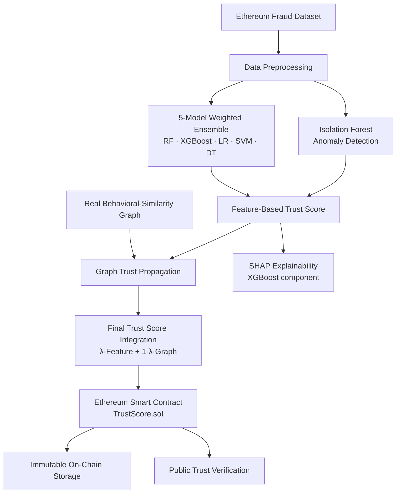

# ABNG — AI-Driven Trust Score Management for Blockchain Nodes

An end-to-end pipeline that scores Ethereum addresses for trustworthiness by combining a weighted supervised fraud-detection ensemble, unsupervised anomaly detection, graph-based relational propagation, and SHAP explainability — with the resulting trust scores enforced immutably on-chain via an Ethereum smart contract.

This repository is the reference implementation for the paper *"AI-Driven Trust Score Management for Blockchain Nodes Using a Multi-Model Machine Learning Ensemble."*

## Table of Contents

- [Overview](#overview)
- [Architecture](#architecture)
- [Results](#results)
- [Project Structure](#project-structure)
- [Setup](#setup)
- [Usage](#usage)
- [Dataset](#dataset)
- [Reproducibility](#reproducibility)
- [Limitations](#limitations)
- [Future Work](#future-work)
- [License](#license)

## Overview

Blockchain consensus protocols guarantee agreement and data integrity among nodes, but they say nothing about whether a given address *behaves* trustworthily. This project builds a **behavioral trust layer** on top of Ethereum:

**Behavioral Evidence** (a weighted 5-model supervised ensemble) **+ Anomaly Evidence** (unsupervised outlier detection) **+ Relational Evidence** (graph-based propagation over interacting addresses) **+ Explainability** (SHAP) **→ Dynamic Trust Score → On-Chain Enforcement**

Every claim in the accompanying paper is backed by a script in this repo that reproduces it — including an honest ablation study, a λ/δ sensitivity grid search, and a GNN baseline comparison, all of which report cases where a component does *not* improve the measured metric rather than only favorable results.

## Architecture



## Results

### Level 1 — Individual classifier performance
(75/25 stratified split, `random_state=42`; see `results/`)

| Model | Accuracy | Precision | Recall | F1 | ROC-AUC | PR-AUC |
|---|---|---|---|---|---|---|
| Logistic Regression | 77.81% | 0.333 | 0.002 | 0.004 | 0.747 | 0.510 |
| SVM (RBF) | 78.34% | 1.000 | 0.022 | 0.043 | 0.874 | 0.588 |
| Decision Tree | 93.70% | 0.872 | 0.839 | 0.855 | 0.902 | 0.767 |
| Random Forest | 95.94% | 0.967 | 0.846 | 0.902 | 0.988 | 0.972 |
| **XGBoost** | **96.99%** | 0.978 | 0.884 | 0.929 | 0.993 | 0.981 |

PR-AUC is reported alongside ROC-AUC because ROC-AUC is optimistic under this dataset's 77.9%/22.1% class imbalance — note how much weaker Logistic Regression and SVM look under PR-AUC despite respectable ROC-AUC scores.

5-fold cross-validation confirms these aren't a favorable split (XGBoost: 96.86% ± 0.46% accuracy), and XGBoost's edge over Random Forest is statistically significant (McNemar's test, p = 0.0002).

### Level 2 — Trust score evaluation
(from `trust_log.csv`, 9,811 scored addresses)

| Trust Tier | Score Range | Addresses | Actual Fraud Rate |
|---|---|---|---|
| HIGH | ≥ 70 | 7,584 | 0.67% |
| MEDIUM | 40–69 | 397 | 75.06% |
| LOW | < 40 | 1,830 | 99.73% |

Mean trust score: **90.69** (benign) vs **27.58** (fraudulent) — a 63-point separation, Spearman ρ = 0.714 (p < 0.001). Fraud containment rate 83.9%, false-alarm rate 0.1%.

### Ablation study & GNN baseline — reported honestly

| Configuration | Accuracy |
|---|---|
| 5-model ensemble (no IF, no graph) | 96.46% |
| + Isolation Forest penalty | 96.42% |
| + Graph trust propagation | 95.49% |
| Full system | 95.69% |
| GCN baseline (same graph/features) | 82.28% |
| GraphSAGE baseline (same graph/features) | 83.95% |

Adding the anomaly penalty and graph propagation **slightly reduces** pure classification accuracy relative to the ensemble alone — this is reported explicitly rather than hidden. A λ/δ sensitivity grid search (`sensitivity_analysis.py`) shows λ=1.0 (no graph) actually maximizes rank correlation and fraud containment on this dataset; λ=0.70 is retained as a deliberate architectural choice for relational robustness, not because it's the metric-optimal point. Two from-scratch GNN baselines (GCN, GraphSAGE) were also trained and substantially underperform the tree-based ensemble, most likely because the graph here is built from cosine similarity over the *same* features the ensemble already uses — see the paper (Section 5.1.7) for the full discussion.

## Project Structure

```
ABNG_project/
├── data/
│   └── ethereum_fraud.csv          # Kaggle Ethereum Fraud Detection dataset
│
├── Core ML pipeline
│   ├── train_model.py              # Trains all 5 supervised classifiers
│   ├── anomaly_detector.py         # Trains Isolation Forest (train-split only, no leakage)
│   ├── evaluate_model.py           # Level-1 metrics, confusion matrices, ROC, SHAP summary (XGBoost)
│   ├── explainability.py           # Per-address SHAP explanations + waterfall plots (XGBoost)
│   └── validate_model_kaggle.py    # Quick sanity check of a saved model
│
├── Graph construction
│   ├── generate_transactions.py    # Synthetic random transaction graph (legacy/baseline)
│   ├── build_real_graph.py         # Real behavioral-similarity graph (cosine similarity, top-K)
│   └── graph_trust.py              # GraphTrust class — weighted-neighbor trust propagation
│
├── Trust engine & blockchain
│   ├── trust_fusion.py             # λ/δ fusion formula (feature trust + graph trust)
│   ├── auto_trust_engine.py        # Main engine: ensemble → anomaly penalty → graph → on-chain
│   ├── check_trust_scores.py       # Reads current on-chain trust scores
│   ├── trust_manager.py            # Trust-tier summary from trust_log.csv
│   ├── sync_test_scores.py         # Legacy standalone ensemble + chain-sync script
│   ├── collector.py                # Live node activity poller (tx count/gas from Ganache)
│   ├── TrustScore.sol              # Solidity smart contract source
│   └── TrustScore_abi.json         # Compiled ABI used by the Python scripts
│
├── Evaluation & research rigor
│   ├── evaluate_full_system.py     # Level-2 evaluation: tiers, containment, false-alarm, Spearman
│   ├── ablation_study.py           # Exact ablation table (RF/XGB only → full system)
│   ├── sensitivity_analysis.py     # λ/δ grid search (Spearman, containment, false-alarm)
│   ├── cross_validation.py         # 5-fold CV, PR-AUC, McNemar's significance test
│   ├── gnn_baseline.py             # GCN / GraphSAGE baseline (pure PyTorch, no torch_geometric)
│   └── visualize_trust_scores.py   # Trust evolution, distribution, and tier charts
│
├── main.py                         # Orchestrates the full pipeline end-to-end
├── requirements.txt
└── results/                        # Generated charts and CSVs (see below)
```

**Not committed to git** (generated by running the pipeline — see `.gitignore`): `*.pkl` model artifacts, and large generated CSVs (`transactions.csv`, `anomaly_results.csv`, `trust_log.csv`, `graph_trust_scores.csv`) — regenerate these by running the pipeline rather than expecting them pre-populated in a fresh clone.

> **Note on `TrustScore.sol`:** the original Solidity source (written in Remix) was misplaced after deployment. The version in this repo is a faithful reconstruction matching the deployed contract's ABI (`TrustScore_abi.json`) and compiler settings (solc 0.8.20, optimizer enabled, 200 runs, Istanbul EVM) — verify it against your own deployed bytecode before treating it as canonical.

## Setup

```bash
git clone <this-repo>
cd ABNG_project
python -m venv venv
venv\Scripts\activate        # Windows
# source venv/bin/activate   # macOS/Linux
pip install -r requirements.txt
```

You'll also need:
- **[Ganache](https://trufflesuite.com/ganache/)** running locally (default `http://127.0.0.1:7545`) for the blockchain-enforcement steps
- The `TrustScore.sol` contract deployed to your Ganache instance (via Remix or Truffle), with its address set via the `CONTRACT_ADDRESS` environment variable (defaults are placeholders in the scripts)
- **PyTorch** (CPU is sufficient) only if you want to run `gnn_baseline.py`:
  ```bash
  pip install torch --index-url https://download.pytorch.org/whl/cpu
  ```

## Usage

Run the full pipeline end-to-end:

```bash
python main.py
```

Or run individual stages:

```bash
python train_model.py              # Step 1: train the 5 supervised classifiers
python anomaly_detector.py         # Step 2: train Isolation Forest
python evaluate_model.py           # Step 3: Level-1 evaluation + charts
python build_real_graph.py         # Step 4: build the real behavioral-similarity graph
python auto_trust_engine.py        # Step 5: compute trust scores + sync to blockchain
python visualize_trust_scores.py   # Step 6: trust-score charts

# Research/evaluation extras
python evaluate_full_system.py     # Level-2 tier validation, containment, Spearman
python ablation_study.py           # Exact ablation table
python sensitivity_analysis.py     # λ/δ grid search
python cross_validation.py         # 5-fold CV + PR-AUC + McNemar's test
python gnn_baseline.py             # GCN/GraphSAGE baseline (requires PyTorch)
```

`auto_trust_engine.py` respects a `MAX_ITERATIONS` environment variable (default 3); since the current pipeline is deterministic given static input data, `MAX_ITERATIONS=1` is sufficient and avoids redundant on-chain transactions:

```bash
MAX_ITERATIONS=1 python auto_trust_engine.py
```

## Dataset

[Ethereum Fraud Detection Dataset](https://www.kaggle.com/datasets/vagifa/ethereum-frauddetection-dataset) (Kaggle) — 9,841 addresses, 77.9% benign / 22.1% fraudulent, 45 aggregate behavioral features per address (transaction counts, Ether volumes, ERC-20 activity, temporal patterns). This dataset provides per-address *aggregate* statistics rather than individual transaction-level records, which is why the transaction graph here is built by behavioral similarity (`build_real_graph.py`) rather than extracted from literal sender→receiver transaction data.

## Reproducibility

All experiments were run with:

- Python 3.12.4
- scikit-learn 1.7.2 · xgboost 3.3.0 · shap 0.52.0 · networkx 3.6.1 · web3.py 7.14.0
- pandas 2.3.3 · numpy 2.3.4 · scipy 1.16.3

All random processes (train/test splitting, model initialization, cross-validation folds) use `random_state=42`.

## Limitations

- The transaction graph is a behavioral-similarity graph over aggregate features, not a literal on-chain transaction-flow graph — this dataset doesn't contain transaction-level records.
- The λ/δ trust-fusion weights are a deliberate architectural choice, not the metric-optimal point on the sensitivity grid (see `sensitivity_analysis.py`'s results).
- SVM and Logistic Regression fail at fraud recall under this dataset's class imbalance without SMOTE/class-weighting.
- Models are offline-trained and don't adapt to new fraud patterns without retraining.
- Blockchain enforcement was evaluated on a local Ganache testnet; gas costs and confirmation times on a public network may differ.
- GCN/GraphSAGE baselines substantially underperform the tree-based ensemble on this feature-derived graph (see `gnn_baseline.py`) — this doesn't rule out a GNN outperforming on a dataset with genuine transaction-level relational structure.

## Future Work

- Class-imbalance handling (SMOTE / class-weighted loss) for the linear/kernel ensemble components
- Deployment on a public Ethereum testnet
- Federated learning for privacy-preserving trust computation across distributed participants
- GNN architectures evaluated on datasets with genuine transaction-level graph structure (e.g., Elliptic)
- Decentralized trust markets and cross-chain trust evaluation

## License

Add your preferred license here (e.g., MIT) — none is currently specified.

## Author

**Harjas Suneja**
Department of Computer Science and Engineering (AI & ML), Vellore Institute of Technology, Chennai
